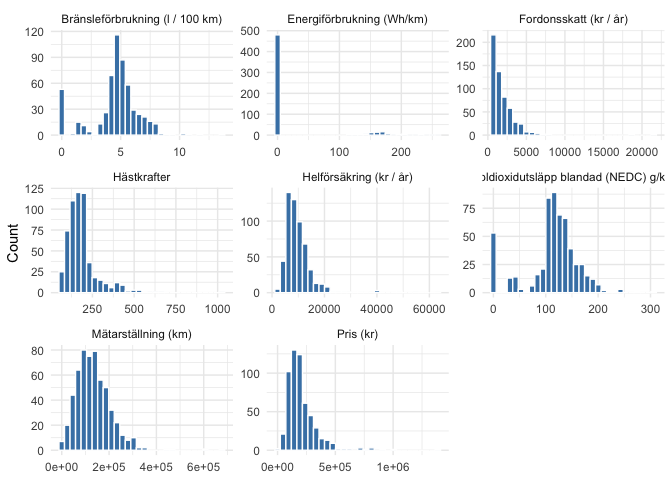

Blocket Car Analysis
================
Geisol Urbina and Maria Lagerholm

- [Introduction](#introduction)
  - [Correlation inspection](#correlation-inspection)
- [Statistical Inference](#statistical-inference)
- [Predictive Modeling](#predictive-modeling)

# Introduction

In this project, we analyze web-scraped used car listings from Blocket,
enriched with technical specifications from Transportstyrelsen and cost
estimates for insurance and taxation in Sweden. The primary goal has
shifted from estimating total yearly ownership cost to two main
objectives: (1) Predicting market prices for used cars in Sweden, with a
focus on non-premium, mid-range vehicles, and (2) Gaining statistical
insight into what factors influence insurance premiums and vehicle
taxes, using linear regression models.

By combining predictive modeling (e.g., random forest) with
inference-driven approaches (e.g., linear regression), we aim to both
improve price prediction accuracy and interpret underlying patterns in
insurance and tax structures in the Swedish car market.

------------------------------------------------------------------------

``` r
packages <- c(
  "tidyverse", "readxl", "fastDummies", "corrplot",
  "rsample", "GGally", "ggcorrplot", "car", "xgboost", "yardstick", "tibble", "ranger", "glmnet", "vip"
)

idx <- packages %in% rownames(installed.packages())
if (any(!idx)) install.packages(packages[!idx])

suppressPackageStartupMessages(
  invisible(lapply(packages, library, character.only = TRUE))
)
```

``` r
# Read the data (adjust file name/path if needed) -------------------------
cars_raw <- read_excel("dataset_final.xlsx")

# 1. Convert character columns that look numeric into numeric --------------
cars_clean <- cars_raw %>%
  mutate(across(
    where(is.character),
    ~ ifelse(
        grepl("^[0-9.,]+$", .x),
        suppressWarnings(as.numeric(gsub(",", "", .x))),
        .x
      )
  )) %>%
  # 2. Convert energy consumption to numeric and replace NAs with 0 --------
  mutate(`Energiförbrukning (Wh/km)` = replace_na(as.numeric(`Energiförbrukning (Wh/km)`), 0)) %>%
  # 3. Convert Modellår to factor ------------------------------------------
  mutate(Modellår = factor(Modellår)) %>%
  # 4. Remove Biltyp completely --------------------------------------------
  select(-Biltyp)

glimpse(cars_clean)
```

    ## Rows: 567
    ## Columns: 15
    ## $ Annons                                 <chr> "Volkswagen", "Ford Kuga 2.0 TD…
    ## $ Fordonsbenämning                       <chr> "VOLKSWAGEN T-ROC", "FORD KUGA"…
    ## $ Handelsbeteckning                      <chr> "T-ROC", "KUGA", "A3 SPORTBACK"…
    ## $ Registreringsnummer                    <chr> "TNG159", "GJD48X", "LRO335", "…
    ## $ `Fordonsskatt (kr / år)`               <dbl> 536, 3886, 360, 1103, 3084, 308…
    ## $ Bränsle                                <chr> "Miljöbränsle/Hybrid", "Diesel"…
    ## $ `Helförsäkring (kr / år)`              <dbl> 3264, 4140, 3984, 3528, 4164, 8…
    ## $ Hästkrafter                            <dbl> 111, 150, 116, 100, 170, 392, 1…
    ## $ `Mätarställning (km)`                  <dbl> 90000, 137420, 52000, 248215, 3…
    ## $ Modellår                               <fct> 2018, 2019, 2017, 2016, 2015, 2…
    ## $ `Bränsleförbrukning (l / 100 km)`      <dbl> 5.2, 6.1, 4.7, 4.2, 5.7, 1.7, 5…
    ## $ `Koldioxidutsläpp blandad (NEDC) g/km` <dbl> 119, 161, 107, 109, 149, 51, 14…
    ## $ `Energiförbrukning (Wh/km)`            <dbl> 0, 0, 0, 0, 0, 149, 0, 160, 0, …
    ## $ `Pris (kr)`                            <dbl> 135000, 160000, 154000, 50000, …
    ## $ Url                                    <chr> "https://www.blocket.se/annons/…

\#Distribution inspection

``` r
# Visualise distributions of all numeric variables -----------------------
numeric_vars <- cars_clean %>%
  select(where(is.numeric)) %>%
  select(where(~ n_distinct(.) > 2)) %>%
  pivot_longer(everything(), names_to = "Variable", values_to = "Value")

ggplot(numeric_vars, aes(Value)) +
  geom_histogram(bins = 30, fill = "steelblue", color = "white") +
  facet_wrap(~ Variable, scales = "free") +
  theme_minimal() +
  labs(x = NULL, y = "Count")
```

<!-- -->

``` r
# Final modelling dataset -------------------------------------------------
cars_clean_inf <- cars_clean %>%
  mutate(
    Helförsäkring_log = log(`Helförsäkring (kr / år)`),
    Hästkrafter_log        = log(Hästkrafter + 1),
    Pris_log          = log(`Pris (kr)`),
    Skatt_log         = log(`Fordonsskatt (kr / år)` + 1),
    Mätar_log         = log(`Mätarställning (km)` + 1),
    Bränsleförb_log   = log(`Bränsleförbrukning (l / 100 km)` + 1)
  ) %>%
  select(
    Helförsäkring_log, Hästkrafter_log, Modellår, Mätar_log,
    Bränsleförb_log, Bränsle, Pris_log, Skatt_log, `Koldioxidutsläpp blandad (NEDC) g/km`
  )

glimpse(cars_clean_inf)
```

    ## Rows: 567
    ## Columns: 9
    ## $ Helförsäkring_log                      <dbl> 8.090709, 8.328451, 8.290042, 8…
    ## $ Hästkrafter_log                        <dbl> 4.718499, 5.017280, 4.762174, 4…
    ## $ Modellår                               <fct> 2018, 2019, 2017, 2016, 2015, 2…
    ## $ Mätar_log                              <dbl> 11.40758, 11.83080, 10.85902, 1…
    ## $ Bränsleförb_log                        <dbl> 1.8245493, 1.9600948, 1.7404662…
    ## $ Bränsle                                <chr> "Miljöbränsle/Hybrid", "Diesel"…
    ## $ Pris_log                               <dbl> 11.81303, 11.98293, 11.94471, 1…
    ## $ Skatt_log                              <dbl> 6.285998, 8.265393, 5.888878, 7…
    ## $ `Koldioxidutsläpp blandad (NEDC) g/km` <dbl> 119, 161, 107, 109, 149, 51, 14…

## Correlation inspection

``` r
cars_clean_inf %>%
  select(where(is.numeric)) %>%
  summarise(across(everything(), ~ cor(.x, cars_clean_inf$Helförsäkring_log, use = "complete.obs"))) %>%
  pivot_longer(everything(), names_to = "Variable", values_to = "Correlation") %>%
  arrange(desc(abs(Correlation)))
```

    ## # A tibble: 7 × 2
    ##   Variable                             Correlation
    ##   <chr>                                      <dbl>
    ## 1 Helförsäkring_log                         1     
    ## 2 Hästkrafter_log                           0.641 
    ## 3 Pris_log                                  0.491 
    ## 4 Skatt_log                                 0.328 
    ## 5 Koldioxidutsläpp blandad (NEDC) g/km      0.177 
    ## 6 Mätar_log                                 0.175 
    ## 7 Bränsleförb_log                           0.0522

# Statistical Inference

``` r
#| message: false
#| warning: false

model_f <- lm(Helförsäkring_log ~ ., data = cars_clean_inf%>%select(-Bränsleförb_log, -Skatt_log, -`Koldioxidutsläpp blandad (NEDC) g/km`))
summary(model_f)
```

    ## 
    ## Call:
    ## lm(formula = Helförsäkring_log ~ ., data = cars_clean_inf %>% 
    ##     select(-Bränsleförb_log, -Skatt_log, -`Koldioxidutsläpp blandad (NEDC) g/km`))
    ## 
    ## Residuals:
    ##      Min       1Q   Median       3Q      Max 
    ## -1.62613 -0.13991  0.01238  0.14633  1.12691 
    ## 
    ## Coefficients:
    ##                             Estimate Std. Error t value Pr(>|t|)    
    ## (Intercept)                 4.425059   0.355816  12.436  < 2e-16 ***
    ## Hästkrafter_log             0.673330   0.043156  15.602  < 2e-16 ***
    ## Modellår2016                0.130499   0.040766   3.201 0.001448 ** 
    ## Modellår2017                0.084723   0.042999   1.970 0.049300 *  
    ## Modellår2018                0.175707   0.045889   3.829 0.000143 ***
    ## Modellår2019                0.189512   0.051514   3.679 0.000257 ***
    ## Modellår2020                0.122110   0.057830   2.112 0.035176 *  
    ## Modellår2021                0.105902   0.067657   1.565 0.118090    
    ## Modellår2022               -0.320774   0.080153  -4.002 7.14e-05 ***
    ## Modellår2023               -0.767089   0.101016  -7.594 1.34e-13 ***
    ## Modellår2024               -0.666266   0.144128  -4.623 4.72e-06 ***
    ## Mätar_log                  -0.002024   0.016187  -0.125 0.900519    
    ## BränsleDiesel               0.191398   0.030503   6.275 7.09e-10 ***
    ## BränsleEl                   0.148035   0.052617   2.813 0.005076 ** 
    ## BränsleMiljöbränsle/Hybrid -0.039388   0.047873  -0.823 0.411004    
    ## Pris_log                    0.088860   0.034501   2.576 0.010267 *  
    ## ---
    ## Signif. codes:  0 '***' 0.001 '**' 0.01 '*' 0.05 '.' 0.1 ' ' 1
    ## 
    ## Residual standard error: 0.2893 on 551 degrees of freedom
    ## Multiple R-squared:  0.6089, Adjusted R-squared:  0.5982 
    ## F-statistic: 57.19 on 15 and 551 DF,  p-value: < 2.2e-16

``` r
confint(model_f)
```

    ##                                    2.5 %      97.5 %
    ## (Intercept)                 3.7261375286  5.12398106
    ## Hästkrafter_log             0.5885590978  0.75810107
    ## Modellår2016                0.0504226542  0.21057577
    ## Modellår2017                0.0002605098  0.16918554
    ## Modellår2018                0.0855680936  0.26584602
    ## Modellår2019                0.0883236695  0.29070109
    ## Modellår2020                0.0085155506  0.23570527
    ## Modellår2021               -0.0269944559  0.23879814
    ## Modellår2022               -0.4782159558 -0.16333214
    ## Modellår2023               -0.9655113110 -0.56866605
    ## Modellår2024               -0.9493729123 -0.38315816
    ## Mätar_log                  -0.0338211684  0.02977225
    ## BränsleDiesel               0.1314817013  0.25131371
    ## BränsleEl                   0.0446815413  0.25138920
    ## BränsleMiljöbränsle/Hybrid -0.1334234613  0.05464811
    ## Pris_log                    0.0210903071  0.15662998

``` r
# Diagnostics -------------------------------------------------------------
par(mfrow = c(2, 2))
plot(model_f)
```

<!-- -->

``` r
par(mfrow = c(1, 1))

vif(model_f)
```

    ##                     GVIF Df GVIF^(1/(2*Df))
    ## Hästkrafter_log 2.297543  1        1.515765
    ## Modellår        2.771852  9        1.058275
    ## Mätar_log       1.371131  1        1.170953
    ## Bränsle         1.945106  3        1.117268
    ## Pris_log        2.612827  1        1.616424

``` r
model_p <- lm(Pris_log ~ .,  data = cars_clean_inf %>% select(-Helförsäkring_log, -Skatt_log, -Bränsleförb_log, -`Koldioxidutsläpp blandad (NEDC) g/km`))

summary(model_p)
```

    ## 
    ## Call:
    ## lm(formula = Pris_log ~ ., data = cars_clean_inf %>% select(-Helförsäkring_log, 
    ##     -Skatt_log, -Bränsleförb_log, -`Koldioxidutsläpp blandad (NEDC) g/km`))
    ## 
    ## Residuals:
    ##     Min      1Q  Median      3Q     Max 
    ## -4.1289 -0.1412  0.0117  0.1672  1.2578 
    ## 
    ## Coefficients:
    ##                            Estimate Std. Error t value Pr(>|t|)    
    ## (Intercept)                 7.97794    0.27817  28.680  < 2e-16 ***
    ## Hästkrafter_log             0.85867    0.03871  22.180  < 2e-16 ***
    ## Modellår2016                0.17899    0.04971   3.601 0.000346 ***
    ## Modellår2017                0.29481    0.05154   5.720 1.75e-08 ***
    ## Modellår2018                0.42122    0.05370   7.844 2.27e-14 ***
    ## Modellår2019                0.52904    0.05943   8.902  < 2e-16 ***
    ## Modellår2020                0.58078    0.06692   8.678  < 2e-16 ***
    ## Modellår2021                0.62544    0.07911   7.906 1.45e-14 ***
    ## Modellår2022                0.80881    0.09269   8.726  < 2e-16 ***
    ## Modellår2023                0.55309    0.12238   4.520 7.58e-06 ***
    ## Modellår2024               -0.00749    0.17780  -0.042 0.966413    
    ## Mätar_log                  -0.05252    0.01984  -2.647 0.008359 ** 
    ## BränsleDiesel               0.03504    0.03760   0.932 0.351811    
    ## BränsleEl                  -0.25781    0.06398  -4.030 6.37e-05 ***
    ## BränsleMiljöbränsle/Hybrid -0.09491    0.05892  -1.611 0.107791    
    ## ---
    ## Signif. codes:  0 '***' 0.001 '**' 0.01 '*' 0.05 '.' 0.1 ' ' 1
    ## 
    ## Residual standard error: 0.3569 on 552 degrees of freedom
    ## Multiple R-squared:  0.6173, Adjusted R-squared:  0.6076 
    ## F-statistic: 63.59 on 14 and 552 DF,  p-value: < 2.2e-16

``` r
confint(model_p)
```

    ##                                  2.5 %      97.5 %
    ## (Intercept)                 7.43153296  8.52434776
    ## Hästkrafter_log             0.78262906  0.93472049
    ## Modellår2016                0.08134198  0.27663646
    ## Modellår2017                0.19356705  0.39604896
    ## Modellår2018                0.31574592  0.52670025
    ## Modellår2019                0.41230182  0.64576999
    ## Modellår2020                0.44932546  0.71223827
    ## Modellår2021                0.47005000  0.78082332
    ## Modellår2022                0.62673511  0.99089234
    ## Modellår2023                0.31271333  0.79347083
    ## Modellår2024               -0.35674788  0.34176737
    ## Mätar_log                  -0.09150270 -0.01354318
    ## BränsleDiesel              -0.03881892  0.10889687
    ## BränsleEl                  -0.38348139 -0.13214465
    ## BränsleMiljöbränsle/Hybrid -0.21064723  0.02082572

``` r
# Diagnostics -------------------------------------------------------------
par(mfrow = c(2, 2))
plot(model_p)
```

<!-- -->

``` r
par(mfrow = c(1, 1))

vif(model_p)
```

    ##                     GVIF Df GVIF^(1/(2*Df))
    ## Hästkrafter_log 1.214864  1        1.102209
    ## Modellår        2.102262  9        1.042142
    ## Mätar_log       1.353948  1        1.163593
    ## Bränsle         1.869131  3        1.109873

``` r
model_s <- lm(Skatt_log ~ .,  data = cars_clean_inf %>% select(-Helförsäkring_log, -Bränsleförb_log))

summary(model_s)
```

    ## 
    ## Call:
    ## lm(formula = Skatt_log ~ ., data = cars_clean_inf %>% select(-Helförsäkring_log, 
    ##     -Bränsleförb_log))
    ## 
    ## Residuals:
    ##      Min       1Q   Median       3Q      Max 
    ## -1.73571 -0.17956  0.00722  0.14782  2.14602 
    ## 
    ## Coefficients:
    ##                                          Estimate Std. Error t value Pr(>|t|)
    ## (Intercept)                             3.7474036  0.3921125   9.557  < 2e-16
    ## Hästkrafter_log                         0.0844377  0.0480966   1.756  0.07972
    ## Modellår2016                           -0.0086872  0.0444502  -0.195  0.84512
    ## Modellår2017                           -0.0051490  0.0468984  -0.110  0.91261
    ## Modellår2018                            0.0722257  0.0500423   1.443  0.14951
    ## Modellår2019                            0.1370839  0.0561549   2.441  0.01495
    ## Modellår2020                            0.3889436  0.0636855   6.107 1.92e-09
    ## Modellår2021                            0.4169018  0.0744365   5.601 3.37e-08
    ## Modellår2022                            0.6054214  0.0878560   6.891 1.52e-11
    ## Modellår2023                            0.5350574  0.1107225   4.832 1.75e-06
    ## Modellår2024                            0.4453881  0.1588154   2.804  0.00522
    ## Mätar_log                              -0.0155264  0.0176585  -0.879  0.37964
    ## BränsleDiesel                           1.0983733  0.0333746  32.910  < 2e-16
    ## BränsleEl                               0.8811862  0.0912131   9.661  < 2e-16
    ## BränsleMiljöbränsle/Hybrid              0.0799366  0.0632723   1.263  0.20699
    ## Pris_log                                0.0571287  0.0382993   1.492  0.13637
    ## `Koldioxidutsläpp blandad (NEDC) g/km`  0.0140908  0.0005157  27.325  < 2e-16
    ##                                           
    ## (Intercept)                            ***
    ## Hästkrafter_log                        .  
    ## Modellår2016                              
    ## Modellår2017                              
    ## Modellår2018                              
    ## Modellår2019                           *  
    ## Modellår2020                           ***
    ## Modellår2021                           ***
    ## Modellår2022                           ***
    ## Modellår2023                           ***
    ## Modellår2024                           ** 
    ## Mätar_log                                 
    ## BränsleDiesel                          ***
    ## BränsleEl                              ***
    ## BränsleMiljöbränsle/Hybrid                
    ## Pris_log                                  
    ## `Koldioxidutsläpp blandad (NEDC) g/km` ***
    ## ---
    ## Signif. codes:  0 '***' 0.001 '**' 0.01 '*' 0.05 '.' 0.1 ' ' 1
    ## 
    ## Residual standard error: 0.3154 on 550 degrees of freedom
    ## Multiple R-squared:  0.8785, Adjusted R-squared:  0.8749 
    ## F-statistic: 248.5 on 16 and 550 DF,  p-value: < 2.2e-16

``` r
confint(model_s)
```

    ##                                              2.5 %     97.5 %
    ## (Intercept)                             2.97718221 4.51762494
    ## Hästkrafter_log                        -0.01003789 0.17891332
    ## Modellår2016                           -0.09600011 0.07862564
    ## Modellår2017                           -0.09727096 0.08697288
    ## Modellår2018                           -0.02607178 0.17052317
    ## Modellår2019                            0.02677966 0.24738819
    ## Modellår2020                            0.26384709 0.51404009
    ## Modellår2021                            0.27068714 0.56311646
    ## Modellår2022                            0.43284702 0.77799588
    ## Modellår2023                            0.31756674 0.75254800
    ## Modellår2024                            0.13342917 0.75734694
    ## Mätar_log                              -0.05021281 0.01915995
    ## BränsleDiesel                           1.03281599 1.16393053
    ## BränsleEl                               0.70201754 1.06035478
    ## BränsleMiljöbränsle/Hybrid             -0.04434826 0.20422140
    ## Pris_log                               -0.01810205 0.13235953
    ## `Koldioxidutsläpp blandad (NEDC) g/km`  0.01307782 0.01510370

``` r
# Diagnostics -------------------------------------------------------------
par(mfrow = c(2, 2))
plot(model_s)
```

<!-- -->

``` r
par(mfrow = c(1, 1))

vif(model_s)
```

    ##                                            GVIF Df GVIF^(1/(2*Df))
    ## Hästkrafter_log                        2.401534  1        1.549688
    ## Modellår                               2.935802  9        1.061658
    ## Mätar_log                              1.373134  1        1.171808
    ## Bränsle                                5.360547  3        1.322924
    ## Pris_log                               2.709625  1        1.646094
    ## `Koldioxidutsläpp blandad (NEDC) g/km` 3.920598  1        1.980050

# Predictive Modeling

``` r
library(dplyr)
library(fastDummies)
library(janitor)
library(rsample)
library(ranger)
library(purrr)
library(yardstick)
library(tibble)
library(vip)

# -----------------------------------------------------------
# Step 1: Data Preparation (log-transformations & dummy vars)
# -----------------------------------------------------------


# Define log-transform target columns
log_vars <- c(
  "pris_log", 
  "fordonsskatt_log", 
  "helforsakring_log",
  "hastkrafter_log",
  "matarstallning_log"
)

# Clean and transform the dataset
cars_price <- cars_clean %>% 
  mutate(id = row_number()) %>%
  transmute(
    id,
    fordonsbenamning = Fordonsbenämning,
    handelsbeteckning = Handelsbeteckning,
    pris = `Pris (kr)`,
    pris_log = log(pris),
    fordonsskatt_log = log(`Fordonsskatt (kr / år)` + 1),
    helforsakring_log = log(`Helförsäkring (kr / år)` + 1),
    hastkrafter_log = log(Hästkrafter + 1),
    matarstallning_log = log(`Mätarställning (km)` + 1),
    #co2 = `Koldioxidutsläpp blandad (NEDC) g/km`
  ) %>%
  clean_names()

# -----------------------------------------------------------
# Step 2: Compute outlier thresholds before splitting
# -----------------------------------------------------------
compute_outlier_bounds <- function(df, columns, lower = 0.01, upper = 0.99) {
  map(columns, function(col) {
    tibble(
      variable = col,
      q_low = quantile(df[[col]], lower, na.rm = TRUE),
      q_high = quantile(df[[col]], upper, na.rm = TRUE)
    )
  }) %>% bind_rows()
}

apply_outlier_filter <- function(df, bounds) {
  for (i in seq_len(nrow(bounds))) {
    col <- bounds$variable[i]
    df <- df %>% filter(.data[[col]] >= bounds$q_low[i], .data[[col]] <= bounds$q_high[i])
  }
  df
}

outlier_bounds <- compute_outlier_bounds(cars_price, log_vars)

# -----------------------------------------------------------
# Step 3: Initial Split (80/20) stratified by log(price)
# -----------------------------------------------------------
set.seed(123)
split <- initial_split(cars_price, prop = 0.8, strata = pris_log)
train <- training(split)
test  <- testing(split)

# Apply outlier removal
train <- apply_outlier_filter(train, outlier_bounds)
test  <- apply_outlier_filter(test, outlier_bounds)

# -----------------------------------------------------------
# Step 4: Hyperparameter Grid Search via 5-fold Cross-validation
# -----------------------------------------------------------
set.seed(123)
folds <- vfold_cv(train, v = 5, strata = pris_log)

param_grid <- expand.grid(
  num.trees     = c(50, 200),
  mtry          = floor(ncol(train)/2),
  min.node.size = c(1, 10),
  max.depth     = c(2, 12)
)

cv_results <- purrr::map_dfr(seq_len(nrow(param_grid)), function(i) {
  p <- param_grid[i, ]
  fold_metrics <- map_dbl(folds$splits, function(spl) {
    tr <- analysis(spl)
    va <- assessment(spl)
    
    mod <- ranger(
      pris_log ~ .,
      data          = tr %>% select(-id, -fordonsbenamning, -handelsbeteckning, -pris),
      num.trees     = p$num.trees,
      mtry          = p$mtry,
      min.node.size = p$min.node.size,
      max.depth     = p$max.depth
    )
    pred <- predict(mod, va)$predictions
    rmse_vec(truth = va$pris_log, estimate = pred)
  })
  
  tibble(
    num.trees     = p$num.trees,
    mtry          = p$mtry,
    min.node.size = p$min.node.size,
    max.depth     = p$max.depth,
    RMSE_log_CV   = mean(fold_metrics)
  )
})

# Select best hyperparameters based on CV
best_params <- cv_results %>% 
  slice_min(RMSE_log_CV, n = 1)


# -----------------------------------------------------------
# Step 5: Train final model on entire training set
# -----------------------------------------------------------
final_model <- ranger(
  pris_log ~ .,
  data          = train %>% select(-id, -fordonsbenamning, -handelsbeteckning, -pris),
  num.trees     = best_params$num.trees,
  mtry          = best_params$mtry,
  min.node.size = best_params$min.node.size,
  max.depth     = best_params$max.depth,
  importance    = "impurity"
)


# -----------------------------------------------------------
# Step 7: Evaluate RMSE (final hold-out test set)
# -----------------------------------------------------------
# Predictions on test set (hold-out)
test_pred_log <- predict(final_model, test)$predictions
test_pred_sek <- exp(test_pred_log)

# Calculate RMSE for test set
rmse_test_log <- rmse_vec(test$pris_log, test_pred_log)
rmse_test_sek <- rmse_vec(test$pris, test_pred_sek)

# Compute SEK equivalent of the CV RMSE_log (0.228)
# Using mean predicted price (SEK) from test set as scaling factor
mean_test_pred_sek <- mean(test_pred_sek)
rmse_cv_sek_equiv <- mean_test_pred_sek * best_params$RMSE_log_CV

# Step 8: Results (CV vs. Test)
results_summary <- tibble(
  Dataset  = c("5-fold CV (grid-search)", "Test set (hold-out)"),
  RMSE_log = round(c(best_params$RMSE_log_CV, rmse_test_log), 4),
  RMSE_SEK = round(c(rmse_cv_sek_equiv, rmse_test_sek), 0)
)

print(results_summary)
```

    ## # A tibble: 2 × 3
    ##   Dataset                 RMSE_log RMSE_SEK
    ##   <chr>                      <dbl>    <dbl>
    ## 1 5-fold CV (grid-search)    0.231    44297
    ## 2 Test set (hold-out)        0.235    56829

``` r
# -----------------------------------------------------------
# Step 9: Residual Analysis – overpriced vs. underpriced cars
# -----------------------------------------------------------
test_results <- test %>% 
  mutate(
    pred_log = test_pred_log,
    pred_sek = test_pred_sek,
    diff_sek = pris - pred_sek,
    diff_pct = 100 * diff_sek / pred_sek
  ) %>% 
  select(id, fordonsbenamning, handelsbeteckning, pris, pred_sek, diff_sek, diff_pct)

overpriced  <- test_results %>% arrange(desc(diff_sek)) %>% slice_head(n = 5)
underpriced <- test_results %>% arrange(diff_sek) %>% slice_head(n = 5)

cat("\nTop 5 Overpriced Cars:\n")
```

    ## 
    ## Top 5 Overpriced Cars:

``` r
print(overpriced)
```

    ## # A tibble: 5 × 7
    ##      id fordonsbenamning     handelsbeteckning   pris pred_sek diff_sek diff_pct
    ##   <int> <chr>                <chr>              <dbl>    <dbl>    <dbl>    <dbl>
    ## 1   481 KIA EV9              EV9               735000  420156.  314844.     74.9
    ## 2   333 BMW X5 XDRIVE45E     X5 XDRIVE45E      560000  360145.  199855.     55.5
    ## 3   269 MERCEDES-BENZ V-KLA… V-KLASSE          469000  329714.  139286.     42.2
    ## 4   360 SUBARU OUTBACK       OUTBACK           305000  185964.  119036.     64.0
    ## 5   478 VOLVO                XC60              270000  166502.  103498.     62.2

``` r
cat("\nTop 5 Underpriced Cars:\n")
```

    ## 
    ## Top 5 Underpriced Cars:

``` r
print(underpriced)
```

    ## # A tibble: 5 × 7
    ##      id fordonsbenamning     handelsbeteckning   pris pred_sek diff_sek diff_pct
    ##   <int> <chr>                <chr>              <dbl>    <dbl>    <dbl>    <dbl>
    ## 1   327 VOLVO V60            V60               329900  417784.  -87884.    -21.0
    ## 2    64 TESLA MODEL 3        MODEL 3           270000  354375.  -84375.    -23.8
    ## 3   390 MITSUBISHI OUTLANDER MITSUBISHI OUTLA… 208000  284415.  -76415.    -26.9
    ## 4     7 BMW X1 XDRIVE20D     X1 XDRIVE20D      164900  237757.  -72857.    -30.6
    ## 5   280 MERCEDES-BENZ AMG C… AMG CLA 45        285000  357659.  -72659.    -20.3

``` r
# -----------------------------------------------------------
# Step 10: Variable importance visualization
# -----------------------------------------------------------
vip(final_model, num_features = 10, bar = TRUE)
```

<!-- -->
